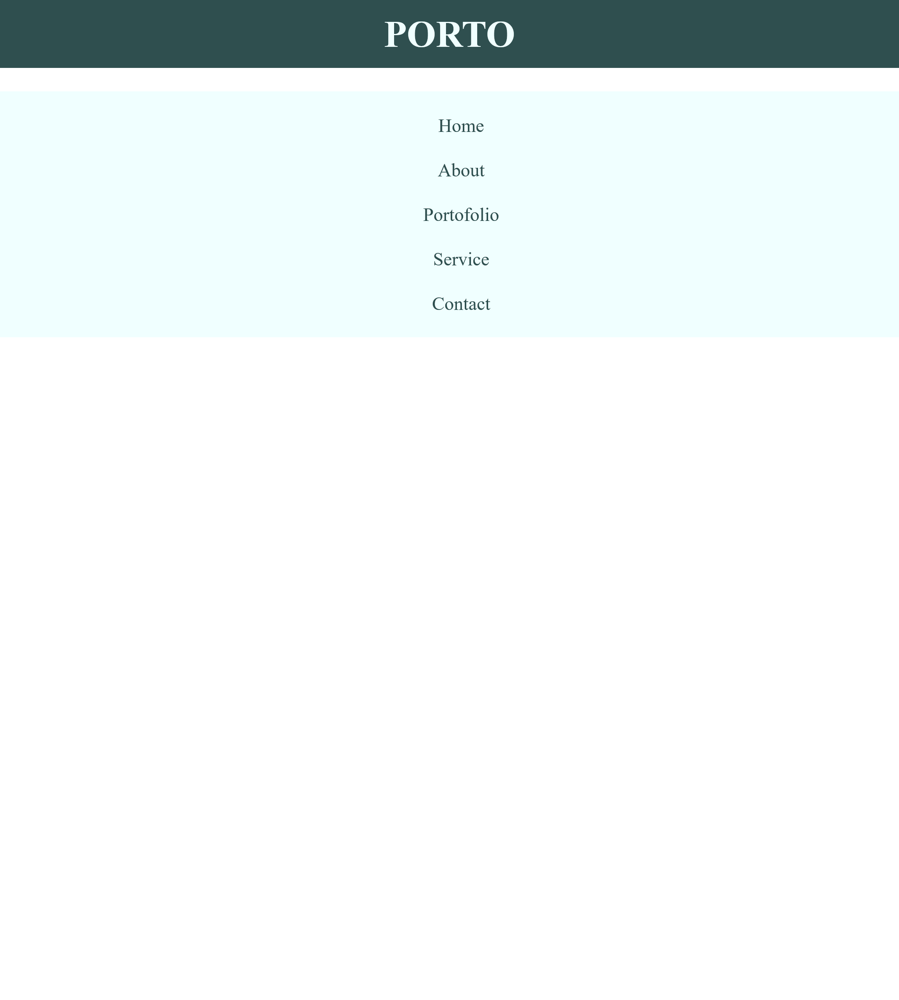
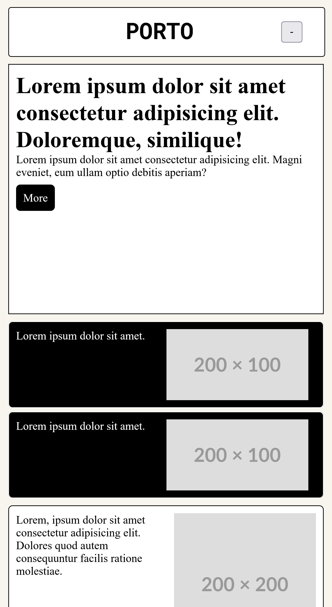

# Navbar Responsive
Navigasi bar yang dibuat menggunakan flexbox dan akan menyesuaikan lebar layar device yang mengaksesnya.

# Hasil
## 1. Jika ukuran layar <768 atau dibawah medium maka tampilan navbar akan menurun

## 2. Jika ukuran layar lebih dari 767 dan kurang dari 1025 maka tampilan navbar akan menjadi mendatar

## New Feature Hamburger Nav

## Cara menjalankan apps
1. download semua resource di repo ini
2. jalankan index.html
